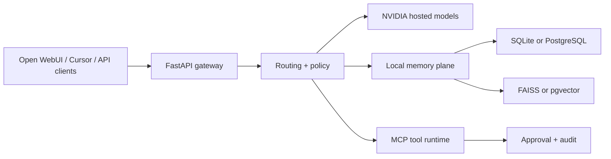

# Hybrid AI Gateway — Product Requirements Document

> A locally controlled AI gateway that unifies hosted model inference, intelligent routing, scoped memory, multimodal processing, MCP tools, explicit approvals, and OpenAI-compatible clients.

| Document control | Value |
|---|---|
| Status | Draft baseline for stakeholder review |
| Version | 1.0 |
| Date | 13 July 2026 |
| Product owner | Md Mahbub Alam |
| Repository | `github.com/Mahbub96/chatbot-mcp` |
| Source baseline | Commit `9fadfd7` — `feat(config): add .env.example for environment variable configuration` |
| Approved direction | Hybrid AI Gateway |
| Intended audience | Product, engineering, security, QA, DevOps, contributors, and integration consumers |

**Product intent:** Deliver one dependable local control plane for AI applications while using NVIDIA-hosted models as the initial inference provider. Keep user-controlled memory, tool policy, approvals, routing, and operational evidence close to the user. Avoid claiming fully local inference, provider independence, enterprise multi-tenancy, or production readiness until those capabilities meet explicit acceptance criteria.

## Document Governance

| Field | Definition |
|---|---|
| Purpose | Defines product outcomes, boundaries, behavior, quality requirements, security controls, acceptance criteria, metrics, and phased delivery. |
| Authority | Once approved, this PRD governs product scope. Architecture documents, ADRs, API specifications, threat models, and test plans provide implementation detail. |
| AI pipeline authority | `docs/architecture/AI_PIPELINE.md` is the source of truth for input normalization, exact short-term capture, long-term extraction, retrieval order, evidence sufficiency, internet fallback, and response modality. |
| Requirement language | **MUST** is mandatory; **SHOULD** is expected unless a documented exception is approved; **MAY** is optional. |
| Evidence model | “Observed” describes repository evidence. “Target” describes required future behavior. Existing code is not automatically production-accepted. |
| Change control | Material changes to provider strategy, trust boundaries, data handling, API compatibility, MVP scope, or acceptance thresholds require a versioned PRD decision. |
| Review points | Architecture freeze, MVP scope freeze, security review, beta readiness, and release-candidate approval. |

### Revision History

| Version | Date | Owner | Summary |
|---|---|---|---|
| 1.0 | 13 Jul 2026 | Md Mahbub Alam | Initial industrialized PRD based on the approved Hybrid AI Gateway direction and repository commit `9fadfd7`. |

### Approval Register

| Role | Name | Decision | Date |
|---|---|---|---|
| Product owner | Md Mahbub Alam | Pending | — |
| Engineering lead | TBD | Pending | — |
| Security reviewer | TBD | Pending | — |
| QA owner | TBD | Pending | — |
| Operations owner | TBD | Pending | — |

## Table of Contents

1. [Executive Summary](#1-executive-summary)
2. [Product Context and Repository Baseline](#2-product-context-and-repository-baseline)
3. [Vision, Positioning, and Principles](#3-vision-positioning-and-principles)
4. [Users and Jobs to Be Done](#4-users-and-jobs-to-be-done)
5. [Scope and Release Boundaries](#5-scope-and-release-boundaries)
6. [Product Experience and Core Journeys](#6-product-experience-and-core-journeys)
7. [Functional Requirements](#7-functional-requirements)
8. [Model Provider and Routing Requirements](#8-model-provider-and-routing-requirements)
9. [Memory and Retrieval Requirements](#9-memory-and-retrieval-requirements)
10. [MCP, Tools, and Approval Requirements](#10-mcp-tools-and-approval-requirements)
11. [Multimodal and Image Requirements](#11-multimodal-and-image-requirements)
12. [Client and Integration Requirements](#12-client-and-integration-requirements)
13. [Data Model and Lifecycle Requirements](#13-data-model-and-lifecycle-requirements)
14. [API and Compatibility Requirements](#14-api-and-compatibility-requirements)
15. [Non-Functional Requirements](#15-non-functional-requirements)
16. [Privacy, Security, and Responsible AI](#16-privacy-security-and-responsible-ai)
17. [Observability and Operations](#17-observability-and-operations)
18. [Quality and Acceptance Strategy](#18-quality-and-acceptance-strategy)
19. [Delivery Roadmap](#19-delivery-roadmap)
20. [Success Metrics](#20-success-metrics)
21. [Risks, Dependencies, and Open Decisions](#21-risks-dependencies-and-open-decisions)
22. [Traceability and Definition of Done](#22-traceability-and-definition-of-done)
23. [Appendices](#appendix-a--observed-api-baseline)

# 1. Executive Summary

The Hybrid AI Gateway is a locally operated middleware and control plane between AI clients and hosted model providers. It exposes an OpenAI-compatible API for chat and image workloads, routes requests to appropriate hosted models, applies the canonical AI pipeline, adds scoped persistent memory, processes image and video inputs, exposes governed tools through MCP, and records operational evidence. Open WebUI is the reference chat client; Cursor can use the MCP bridge for actions or the OpenAI-compatible interface for chat.

The approved product is **hybrid**, not fully local. The gateway, memory services, vector indexes, policy evaluation, approval state, request routing, and operational controls run locally. The initial model inference, embedding, vision, and image-generation services depend on NVIDIA-hosted APIs and therefore require internet access, valid credentials, provider availability, and quota.

The repository already contains a substantial prototype: FastAPI gateway routes, OpenAI-compatible chat completions, model routing, streaming, NVIDIA upstream integration, image generation and editing, image/video materialization, a local MCP bridge, file and shell tools, an approval flow, SQLite-backed memory, FAISS or pgvector retrieval, in-process or Redis/RQ memory jobs, health endpoints, metrics, rate limiting, structured logging, request IDs, tests, and a Docker-started Open WebUI.

This PRD upgrades that prototype into a credible product contract. The first production target is not to add every imaginable provider or autonomous capability. It is to harden one safe, observable, documented gateway deployment for a single trusted operator or trusted local environment, with NVIDIA as the first supported provider and explicit boundaries for tools, memory, network access, and client compatibility.

> **Product thesis:** Developers and privacy-conscious power users will adopt a hybrid gateway when it gives them a familiar API and UI, intelligent model selection, useful personal memory, and controlled tools—without surrendering local governance or accepting opaque autonomous actions.

## 1.1 Problem Statement

- AI applications often become tightly coupled to one provider, model identifier, request format, and retry behavior.
- Chat interfaces, model routing, memory, multimodal normalization, tools, permissions, and operational telemetry are commonly implemented as disconnected systems.
- Hosted model access simplifies local hardware requirements but introduces credential, availability, quota, privacy, and data-egress risks.
- Tool-enabled assistants can execute dangerous actions when model intent is treated as authorization.
- Memory systems can retrieve irrelevant, stale, cross-user, or sensitive information when scope and lifecycle rules are weak.
- AI pipelines often blur exact short-term conversation traces, durable long-term facts, model background knowledge, tool results, and external search evidence.
- OpenAI-compatible clients need predictable streaming, errors, model discovery, and backward compatibility even when the upstream provider behaves differently.
- Prototype gateways frequently expose local APIs without authentication, durable approval semantics, security hardening, or documented deployment boundaries.

## 1.2 Proposed Solution

Provide a local FastAPI gateway with seven product planes:

1. **Client plane:** OpenAI-compatible chat and image APIs plus compatibility endpoints for Open WebUI and other clients.
2. **AI pipeline plane:** Text-first input normalization, exact short-term capture, AI-filtered long-term extraction, local evidence retrieval, evidence sufficiency decisions, policy-gated external fallback, and response modality handling.
3. **Routing plane:** Deterministic modality, code, language, and default-model selection with bounded fallback.
4. **Provider plane:** A normalized hosted-inference adapter, initially for NVIDIA NIM-compatible endpoints.
5. **Memory plane:** Scoped short-term and long-term memory with authoritative relational storage and rebuildable vector indexes.
6. **Action plane:** MCP-exposed capabilities, deterministic policy, explicit approvals, bounded execution, and verifiable results.
7. **Operations plane:** Readiness, metrics, structured logs, request correlation, rate limits, lifecycle control, and diagnostic guidance.

## 1.3 Product Outcomes

| Outcome | Target signal |
|---|---|
| Unified integration | A compatible client can use one local base URL for model discovery, chat, images, memory, and approved tools. |
| Lower local hardware burden | Hosted inference works on a supported machine without requiring a local LLM-capable GPU. |
| Controlled agency | Sensitive file and shell actions cannot execute without the required deterministic approval. |
| Useful continuity | Memory improves eligible conversations without leaking across scopes or polluting durable facts. |
| Grounded answers | The gateway distinguishes local memory, external evidence, model inference, no-result states, and failures instead of fabricating retrieved facts. |
| Provider resilience | Upstream timeouts, rate limits, invalid credentials, retired models, and unavailable modalities produce stable, actionable gateway behavior. |
| Operational clarity | Operators can determine whether failures originate in the gateway, provider, memory backend, media tooling, queue, or client. |

# 2. Product Context and Repository Baseline

## 2.1 Observed Technology Baseline

| Area | Observed implementation | Product interpretation |
|---|---|---|
| Gateway | Python and FastAPI application in `gateway/` | Primary product service and local control plane. |
| Reference UI | Open WebUI started through Docker by `start.sh` | External reference client; its full product behavior is not owned by this repository. |
| Hosted provider | NVIDIA Integrate/NIM-compatible endpoints configured through environment variables | Initial required provider dependency; not local inference. |
| Chat API | `POST /v1/chat/completions` plus `POST /chat` compatibility route | OpenAI-style client integration with streaming and non-streaming paths. |
| Routing | Vision, code, Bangla, and default model selection | Candidate deterministic routing policy requiring formal precedence and capability validation. |
| Memory | SQLite/SQLAlchemy with FAISS or pgvector; short/long-term services and retrieval pipeline | Local authoritative memory with derived semantic index; requires governance and migration hardening. |
| Queueing | In-process queue or Redis/RQ worker with fallback | Useful asynchronous memory path; failure and delivery semantics must be defined. |
| Tools | Registry discovery, file tools, and approval-gated shell tool | Initial bounded action surface; not a general autonomous agent. |
| MCP | HTTP gateway endpoints plus `cursor_mcp_server.py` FastMCP bridge | Local action integration for Cursor and other MCP-capable clients. |
| Multimodal | Image materialization, video-frame extraction, YouTube resolution/metadata fallback | Network- and binary-dependent feature with material SSRF, privacy, size, and reliability considerations. |
| Images | Text-to-image and image-edit proxy routes | Provider-dependent capability requiring stable response and policy contracts. |
| Operations | Liveness/readiness, Prometheus text metrics, structured request logs, rate limiting, graceful client shutdown | Good baseline that needs production-grade storage, cardinality, auth, and alerting decisions. |
| Tests | Unit and FastAPI tests around routing, memory, health, metrics, and multimodal materialization | Useful but incomplete coverage; reproducible environment and broader security/integration tests are required. |

## 2.2 Current Strengths

- Clear separation among gateway routes, controllers, agents, routers, tools, permissions, and memory modules.
- OpenAI-compatible endpoints reduce client integration friction.
- Deterministic routing exists alongside optional LLM intent suggestions.
- Memory writes can occur asynchronously to protect the chat fast path.
- FAISS and pgvector backends provide a practical local-to-scaled retrieval path.
- Sensitive example actions have an explicit approval flow.
- Request IDs, timing headers, health endpoints, metrics, and structured logging already exist.
- Configuration covers timeouts, retries, fallback models, memory thresholds, media limits, and queue behavior.
- Multimodal handling supports more than static image inputs, including video frame extraction and YouTube fallbacks.

## 2.3 Baseline Gaps and Product Risks

- The gateway currently ignores the client API key; general authentication and authorization are not a completed boundary.
- Loopback deployment is implied but must be enforced and documented; network exposure changes the threat model materially.
- Approval records appear suited to a local process rather than durable, authenticated, multi-client governance.
- File URLs and private/local HTTP targets are accepted in multimodal flows, creating SSRF and local-data exfiltration risk if the gateway is exposed or untrusted content is processed.
- Hosted provider data handling conflicts with any claim that prompts, files, images, or embeddings remain entirely local.
- Model identifiers and provider availability are configuration-driven but capability discovery and compatibility validation are incomplete.
- Memory contains legacy and newer architectural paths, increasing duplication, migration, and semantic-consistency risk.
- A committed FAISS index under `files/faiss_store/` is derived runtime data and may unintentionally contain user content.
- Open WebUI is externally versioned; compatibility, security settings, and upgrade policy are not frozen.
- The rate limiter and metrics collector are process-local, which is insufficient for multiple workers or distributed deployment.
- Media features depend on FFmpeg and yt-dlp, but prerequisite validation, sandboxing, update policy, and malicious-media handling need formal controls.
- The existing test suite could not be fully executed in the inspection environment because runtime dependencies were not installed; reproducible CI must become authoritative.

## 2.4 Product Positioning

The product is a **local AI gateway and governed integration platform**. It is not:

- a fully local or offline AI system;
- a hosted SaaS service;
- a complete end-user chat product owned independently of Open WebUI;
- an unrestricted autonomous agent;
- an enterprise multi-tenant identity platform in the MVP;
- a guarantee of provider uptime, factual correctness, or unlimited quota.

# 3. Vision, Positioning, and Principles

## 3.1 Vision

Make advanced hosted AI capabilities feel like one coherent, locally governed platform that developers can inspect, extend, and trust.

## 3.2 Mission

Unify AI client compatibility, model routing, memory, multimodal normalization, MCP actions, approval policy, and operational evidence behind one dependable local gateway.

## 3.3 Product Principles

| Principle | Decision rule |
|---|---|
| Local control, honest egress | Keep governance and durable user state local, but clearly disclose every class of data sent to hosted providers. |
| Deterministic authority | The model may suggest an intent or action; deterministic code grants permissions and selects policy. |
| Compatible, not deceptive | Match documented OpenAI-compatible contracts and explicitly document unsupported or divergent behavior. |
| Safe before autonomous | Prefer bounded, reviewable actions over broad unattended execution. |
| Fast path first | Keep chat latency independent from best-effort memory classification, indexing, and nonessential telemetry. |
| Evidence over claims | Never report an action, memory write, source retrieval, or provider result as successful without observable evidence. |
| Local evidence first | Search scoped local short-term and long-term memory before any external search fallback, and never search the internet for private personal-memory misses. |
| Derived data is rebuildable | Relational records and explicit configuration are authoritative; vector indexes and caches can be recreated. |
| Failure is a product state | Rate limits, invalid keys, model retirement, timeouts, queue outages, and dependency absence must have designed behavior. |
| Extensible by contract | Add providers, tools, vector backends, and clients behind typed versioned interfaces rather than scattered branching. |

## 3.4 Objectives

1. Production-harden the current gateway for a trusted single-operator/local deployment.
2. Stabilize OpenAI-compatible chat, streaming, image, model-discovery, and error contracts.
3. Make NVIDIA the first formally supported hosted provider behind an explicit adapter boundary.
4. Deliver scoped, inspectable, deletable memory with measurable retrieval quality.
5. Align request handling to the canonical AI pipeline: text-first input, exact short-term capture, normalized long-term facts, evidence sufficiency, and response text as the primary output.
6. Make MCP tool execution deterministic, approval-controlled, bounded, and auditable.
7. Provide reproducible installation, health verification, CI, diagnostics, and release artifacts.
8. Preserve a clean path to additional hosted or local providers, internet search, and STT/TTS adapters without making them MVP commitments.

## 3.5 Non-Goals

- Fully offline inference in the MVP.
- Supporting every OpenAI API or every NVIDIA model.
- Multi-provider routing in the MVP.
- Enterprise SSO, organizations, billing, quotas, or tenant administration.
- Unattended arbitrary shell execution.
- General browser automation, email sending, or third-party account access.
- Voice input/output, STT/TTS adapters, wake word, OCR productization, or desktop application control in Phase 1. When later implemented, STT/TTS must wrap the same text-first AI pipeline rather than becoming a separate assistant path.
- Internet-search fallback execution in Phase 1 unless separately approved. When later implemented, it must be local-memory-first, policy-gated, and ineligible for private personal-memory misses.
- Training or fine-tuning models.
- Replacing Open WebUI with a custom frontend in the MVP.
- Guaranteeing that all third-party URLs or media can be fetched and interpreted.

# 4. Users and Jobs to Be Done

## 4.1 Primary Persona — Technical Operator

A developer or advanced user who runs the gateway on a trusted workstation or development server, owns the provider credentials, configures models and tools, and wants one controlled AI endpoint for Open WebUI, Cursor, scripts, and local workflows.

| Need | Pain | Success |
|---|---|---|
| One integration endpoint | Each client needs different provider settings and behavior. | Clients use one documented local gateway URL. |
| Model specialization | One model performs poorly across code, Bangla, and vision. | Deterministic routing selects an eligible configured model and explains failures. |
| Persistent context | Hosted chats lack locally governed continuity. | Scoped memory improves answers and can be inspected or deleted. |
| Safe tools | Agent actions may damage files or execute unsafe commands. | Policy and approval prevent unauthorized execution. |
| Operational visibility | Provider and gateway failures look identical. | Health, logs, metrics, and stable errors identify the failing boundary. |

## 4.2 Secondary Personas

| Persona | Job | Constraint |
|---|---|---|
| AI application developer | Integrate an OpenAI-compatible client with routing and memory. | Needs stable schemas, streaming semantics, and test fixtures. |
| Cursor/MCP user | Invoke local tools through a standard MCP client. | Needs explicit approvals and predictable tool results. |
| Platform engineer | Package and operate the gateway reliably. | Needs secure configuration, readiness, metrics, backups, and upgrades. |
| Contributor | Add a provider, tool, router, or memory strategy. | Needs architecture boundaries, coding standards, and contract tests. |
| Security reviewer | Verify data egress and action controls. | Needs a data-flow map, threat model, redaction policy, and audit evidence. |

## 4.3 Jobs to Be Done

- When I connect a compatible chat client, give it one predictable model API even if the upstream provider has different failure and streaming behavior.
- When my prompt is code-heavy, Bangla, or multimodal, route it to a configured eligible model without requiring manual selection every turn.
- When I tell the assistant a durable fact, store it only when policy considers it useful, retrieve it only in the correct scope, and let me remove it.
- When an MCP client requests a sensitive tool, show the exact proposed action and require the correct approval before execution.
- When an upstream model fails or becomes unavailable, return a stable diagnostic and bounded fallback rather than hanging or fabricating success.
- When I operate the stack, tell me whether the gateway, provider credentials, memory backend, queue, Open WebUI, FFmpeg, or yt-dlp needs attention.

# 5. Scope and Release Boundaries

## 5.1 Release Phases

| Phase | Outcome | In scope | Deferred |
|---|---|---|---|
| Phase 0 — Foundation | Trustworthy engineering baseline | Architecture contracts, config validation, CI, migrations, dependency locking, threat model, secret handling, loopback default, stable errors | New user-facing capability breadth |
| Phase 1 — Production MVP | Reliable Hybrid AI Gateway for a trusted operator | NVIDIA chat, streaming, deterministic routing, Open WebUI compatibility, scoped memory, MCP bridge, file/shell approval controls, health, metrics, logs, documentation | Multi-provider, enterprise multi-user, full local inference |
| Phase 2 — Memory & retrieval hardening | Measurable and governable memory | Consolidated memory architecture, exact short-term retention, normalized long-term facts, evidence sufficiency, evaluation, lifecycle UI/API, backup/rebuild, pgvector production profile | Document knowledge-base platform |
| Phase 3 — Provider and evidence platform | Additional provider and evidence adapters | Provider registry, capability negotiation, credential profiles, fallback policy, optional Ollama/local adapter, policy-gated internet search adapter | Provider marketplace and billing |
| Phase 4 — Governed tools | Broader safe action ecosystem | Signed capability manifests, stronger sandboxing, durable approvals, audit export, additional bounded tools | Unattended high-risk autonomy |
| Phase 5 — Team deployment | Authenticated shared gateway | Identity, tenancy, RBAC, distributed rate limits/metrics, HA data services | Public multi-tenant SaaS unless separately approved |

## 5.2 MVP Definition

Phase 1 is the minimum viable production release. It supports one trusted operator or trusted local environment, NVIDIA-hosted inference, OpenAI-compatible chat, configured model routing, local scoped memory, bounded MCP tools, explicit approval for sensitive actions, and operational diagnostics.

The MVP is not complete merely because the current routes execute. It must pass the security, compatibility, failure-mode, recovery, documentation, and release criteria in this PRD.

## 5.3 MVP In Scope

- One-command or documented deterministic startup for gateway and reference Open WebUI.
- NVIDIA credential and model configuration validation.
- OpenAI-compatible model listing and chat completions.
- Streaming and non-streaming text chat.
- Deterministic routing for vision, code, Bangla, and default text.
- Image inputs through configured vision models.
- Text-to-image and image-edit proxy routes when configured.
- Scoped local memory with SQLite and FAISS as the default profile.
- Optional pgvector and Redis/RQ profiles with explicit readiness checks.
- MCP bridge and tool discovery.
- Sandboxed file operations and approval-gated shell execution.
- Liveness, readiness, request correlation, structured logs, rate limits, and metrics.
- Open WebUI and Cursor integration documentation.

## 5.4 Explicitly Out of Scope for MVP

- Fully local model inference and offline operation.
- Automatic failover across different providers.
- Public internet exposure.
- Multi-user authentication, tenant isolation, and per-user provider credentials.
- Durable distributed approval workflows.
- General filesystem access outside an approved root.
- Arbitrary unattended shell, network, browser, email, or cloud actions.
- Custom first-party frontend.
- Voice, wake word, scheduled automation, and multi-agent orchestration.
- Internet-search fallback execution unless separately approved for a later phase.
- A general document RAG ingestion product.

# 6. Product Experience and Core Journeys

## 6.1 First-Run Journey

1. Operator copies `.env.example` to `.env` and supplies the required provider credential.
2. Preflight validates Python, Docker, required ports, writable storage, provider connectivity, configured models, and optional FFmpeg/yt-dlp/Redis/Postgres dependencies.
3. The system clearly distinguishes required, optional, unavailable, and degraded components.
4. Gateway binds to loopback by default and starts before Open WebUI is presented as ready.
5. Operator receives URLs, readiness status, configured model routes, memory backend, and security warnings.
6. A documented smoke test verifies model discovery, chat, memory, MCP tools, and metrics without performing a sensitive action.

## 6.2 Chat Journey

1. Client submits an OpenAI-compatible request with messages and optional streaming.
2. Gateway validates schema, size, client policy, modality, and memory scope, then normalizes input into the canonical AI pipeline.
3. Router selects an eligible model using deterministic precedence.
4. Eligible local short-term and long-term memory is retrieved before external fallback is considered.
5. Gateway determines whether local evidence is sufficient and injects bounded evidence with explicit boundaries from system instructions.
6. Provider adapter sends only required content upstream and applies bounded retry/fallback policy.
7. Gateway streams or returns a normalized text result with request ID, evidence/failure state, and usage data where available.
8. Exact short-term turn capture and long-term memory candidate processing follow the AI pipeline; a memory failure does not retroactively fail the successful answer.

## 6.3 MCP Tool Journey

1. Client discovers tools through the MCP bridge or gateway tool endpoint.
2. Client proposes a tool name and validated arguments.
3. Registry resolves the exact versioned capability; policy classifies risk and scope.
4. Read-only low-risk action may execute within policy; sensitive action returns an approval request without executing.
5. Operator approves or rejects the exact immutable action.
6. Client resubmits with the approval reference; gateway verifies identity, binding, expiry, arguments, and unused status.
7. Executor runs with timeout and bounded output, verifies postconditions, records the result, and consumes the approval.

## 6.4 Memory Journey

1. User shares a possible preference or durable fact.
2. Short-term memory captures the accepted user wording and final assistant text exactly, subject to TTL and count limits.
3. Fast path answers without waiting for long-term memory classification or embedding.
4. Memory pipeline filters low-signal content, classifies category/importance, and stores accepted durable information as normalized facts rather than blind utterance copies.
5. Vector index and normalized long-term attributes are updated as derived data.
6. A later request retrieves only relevant local records from the resolved scope before any future internet-search fallback.
7. User or operator can list, search, delete, reindex, and verify lifecycle state.

## 6.5 Multimodal Journey

1. Client sends image content or a supported video/YouTube reference.
2. Gateway validates scheme, destination policy, type, size, and modality configuration.
3. Approved media is materialized, or video is sampled into bounded frames.
4. Router selects an eligible vision model.
5. Gateway sends normalized inputs to the hosted provider and returns a normalized answer.
6. If materialization or vision inference fails, the response distinguishes configuration, fetch, decode, timeout, and provider errors.

# 7. Functional Requirements

## 7.1 Gateway Lifecycle and Configuration

| ID | Priority | Requirement | Acceptance summary |
|---|---|---|---|
| FR-GWY-001 | Must | The gateway MUST bind to `127.0.0.1` by default. | A default start is inaccessible from another host. |
| FR-GWY-002 | Must | Startup MUST validate required credentials, model identifiers, ports, storage paths, and dependency profiles before declaring readiness. | Missing required configuration produces a stable actionable failure. |
| FR-GWY-003 | Must | Optional dependencies MUST be reported as available, unavailable, or degraded without blocking unrelated core functionality. | Missing yt-dlp does not block text chat; its feature is marked unavailable. |
| FR-GWY-004 | Must | Configuration MUST be typed, validated, centrally documented, and free from hard-coded secrets. | Invalid numeric, enum, URL, and path values fail before service readiness. |
| FR-GWY-005 | Must | Graceful shutdown MUST stop accepting new work, finish or cancel bounded tasks, close HTTP/database clients, and persist safe derived state. | Shutdown does not corrupt the vector index or leak clients. |
| FR-GWY-006 | Should | Preflight SHOULD detect compatible Python, Docker, FFmpeg, yt-dlp, Redis, Postgres/pgvector, and available disk. | Operator sees a component matrix before workload traffic. |
| FR-GWY-007 | Must | The gateway MUST publish build version, configuration schema version, and enabled capability summary without exposing secrets. | Support can identify the running contract from a diagnostic response. |

## 7.2 Chat Completions

| ID | Priority | Requirement | Acceptance summary |
|---|---|---|---|
| FR-CHAT-001 | Must | `POST /v1/chat/completions` MUST support the documented subset of OpenAI-compatible streaming and non-streaming requests. | Contract tests pass for supported fields and reject unsupported dangerous inputs clearly. |
| FR-CHAT-002 | Must | Streaming MUST define event framing, delta ordering, terminal completion, errors, client cancellation, and upstream disconnect behavior. | Every stream has one terminal outcome and no duplicate content. |
| FR-CHAT-003 | Must | The gateway MUST validate message roles, content forms, request size, modality, and model/capability compatibility. | Invalid inputs never reach the provider. |
| FR-CHAT-004 | Must | Client cancellation MUST stop upstream work where supported and stop downstream streaming promptly. | Cancellation is observed within the approved latency target. |
| FR-CHAT-005 | Must | Provider failure MUST map to a stable gateway error code without leaking credentials or raw sensitive payloads. | Invalid key, timeout, rate limit, retired model, and provider 5xx are distinguishable. |
| FR-CHAT-006 | Must | Successful user input MUST not be silently lost because asynchronous memory storage fails. | The chat result remains successful and memory failure is separately observable. |
| FR-CHAT-007 | Should | Usage metadata SHOULD be normalized when the upstream supplies it and marked unavailable otherwise. | No fabricated token count is returned. |
| FR-CHAT-008 | Must | The compatibility `POST /chat` route MUST be documented, tested, or formally deprecated. | Clients receive a defined migration window before removal. |
| FR-CHAT-009 | Should | Response humanization MAY apply only as a transparent prompt policy that does not override safety, tool policy, or requested structured output. | JSON/schema requests are not corrupted by style injection. |
| FR-CHAT-010 | Must | Text requests MUST enter the canonical AI pipeline defined by `docs/architecture/AI_PIPELINE.md`. | Input normalization, scope resolution, retrieval, response generation, and memory handoff share one request ID. |
| FR-CHAT-011 | Must | The gateway MUST determine local evidence sufficiency before using any future external search fallback. | Sufficient local evidence causes zero search-provider calls. |
| FR-CHAT-012 | Must | Answers MUST distinguish local evidence, external evidence, model inference, no-result, and failure states where the client contract supports it. | Evidence-required no-result tests contain no fabricated facts or false citations. |
| FR-CHAT-013 | Must | Future voice/STT input and TTS output MUST wrap the same text-first pipeline rather than bypassing chat, memory, retrieval, or policy. | Equivalent accepted text and STT transcripts produce equivalent routing and retrieval; TTS failure preserves text. |

## 7.3 Model Discovery

| ID | Priority | Requirement | Acceptance summary |
|---|---|---|---|
| FR-MOD-001 | Must | `GET /v1/models` MUST return only gateway model IDs and capabilities that are configured and eligible for client use. | A client cannot select a known-unavailable route. |
| FR-MOD-002 | Must | The gateway MUST distinguish public gateway aliases from provider-specific model identifiers. | Provider model changes do not require every client to reconfigure. |
| FR-MOD-003 | Should | Model metadata SHOULD declare text, vision, image generation, image editing, streaming, language/code specialization, and availability. | Routing and UI can validate capability before execution. |
| FR-MOD-004 | Must | Provider model retirement or access denial MUST produce an operator diagnostic and must not be misreported as user input failure. | A 410/403 identifies the model/provider remediation. |

# 8. Model Provider and Routing Requirements

## 8.1 Provider Boundary

NVIDIA is the first supported hosted provider. Provider-specific endpoints, authorization headers, retry semantics, model names, and response normalization must be isolated behind an adapter contract. Adding another provider is a later phase and must not introduce provider conditions throughout controllers, memory, or tools.

| ID | Priority | Requirement | Acceptance summary |
|---|---|---|---|
| FR-PRV-001 | Must | Provider credentials MUST be loaded from approved secret configuration and never returned by APIs, logs, metrics, memory, or tool output. | Secret-scanning fixtures find no credential in retained artifacts. |
| FR-PRV-002 | Must | Provider requests MUST use bounded connect, read, write, total, and retry budgets appropriate to modality. | Stalled upstream calls terminate predictably. |
| FR-PRV-003 | Must | Retries MUST occur only for retry-safe failures and MUST respect a request-level budget. | Invalid credentials and validation errors are not retried. |
| FR-PRV-004 | Must | Fallback MUST preserve modality and declared capability. | A vision request never falls back to a text-only model. |
| FR-PRV-005 | Must | The gateway MUST disclose that prompts, selected memory context, and media sent for inference leave the local system. | Operator documentation contains an accurate data-egress map. |
| FR-PRV-006 | Should | Provider health SHOULD use cached/bounded checks to avoid creating excessive cost or startup dependence. | Readiness is useful without continuously consuming inference quota. |
| FR-PRV-007 | Must | Provider response normalization MUST reject malformed success responses. | Empty or invalid output is not presented as a valid completion. |

## 8.2 Routing Precedence

The target deterministic precedence is:

1. Explicitly supported client model alias, when policy allows selection.
2. Multimodal/vision requirement.
3. Code-specialized intent.
4. Bangla-language intent.
5. Default text model.

If multiple specializations apply, capability is mandatory and preference is policy-driven. For example, a Bangla request containing an image must use a vision-capable route; language specialization cannot override modality.

| ID | Priority | Requirement | Acceptance summary |
|---|---|---|---|
| FR-RTE-001 | Must | Routing MUST be deterministic for the same normalized request and configuration. | Repeat tests select the same route. |
| FR-RTE-002 | Must | Modality capability MUST take precedence over language or code specialization when required. | Image requests never reach text-only models. |
| FR-RTE-003 | Must | Optional LLM intent suggestion MUST be advisory and unable to expand permission, tool access, network scope, or modality. | Adversarial suggestions cannot alter authority. |
| FR-RTE-004 | Must | Missing specialized configuration MUST follow an explicit fallback or configuration-error policy. | No silent model substitution outside policy. |
| FR-RTE-005 | Should | Routing results SHOULD be observable through sanitized reason codes and selected gateway alias. | Operators can debug selection without chain-of-thought. |
| FR-RTE-006 | Must | Code and Bangla detectors MUST have regression fixtures, including mixed-language and code-fence cases. | Routing precision meets the approved evaluation threshold. |
| FR-RTE-007 | Must | Route selection MUST happen before provider execution and remain stable for the request unless an approved compatible fallback is triggered. | Retried requests do not unpredictably change capabilities. |

# 9. Memory and Retrieval Requirements

## 9.1 Memory Taxonomy

| Layer | Purpose | Authority | Lifecycle |
|---|---|---|---|
| Request context | Current messages supplied by the client | Request payload | Request-bounded unless explicitly stored |
| Short-term exact traces | Exact accepted user wording, final assistant text, queue state, and retrieval logs | Relational tables | TTL and count bounded; production profile retains unexpired rows across ordinary restart |
| Durable memory records | Accepted facts, preferences, events, and manually stored content | SQLite/PostgreSQL relational records | Retained until policy/delete |
| Normalized long-term facts | Structured attributes promoted from accepted candidates, not blind utterance copies | Relational records | Independently inspectable and correctable |
| Vector index | Semantic lookup over eligible records | FAISS or pgvector derived index | Rebuildable and reconciled |
| Retrieval evidence | Selected memory IDs, scores, method, filters, and timing | Operational trace | Bounded and redacted |

## 9.2 Memory Requirements

| ID | Priority | Requirement | Acceptance summary |
|---|---|---|---|
| FR-MEM-001 | Must | Relational records MUST be authoritative; FAISS and pgvector indexes MUST be treated as derived. | Reindex recreates equivalent searchable state from source records. |
| FR-MEM-002 | Must | Every memory operation MUST resolve an explicit scope before read or write. | Missing or ambiguous scope fails safely; no cross-scope retrieval occurs. |
| FR-MEM-003 | Must | Memory auto-store MUST filter low-signal, transient, unsafe, and assistant-disclaimer content. | Evaluation fixtures meet approved precision and pollution thresholds. |
| FR-MEM-004 | Must | Durable promotion MUST store normalized facts rather than blind copies of every utterance, while preserving source, category, importance/confidence, timestamps, and extraction version. | A fact can be traced to its origin and classifier version; noisy exact speech is rejected from long-term memory. |
| FR-MEM-005 | Must | Retrieval MUST apply scope, category/source filters, score thresholds, intent rules, evidence sufficiency, and a bounded context budget. | Irrelevant or cross-scope memories are not injected, and insufficient evidence is identified before answer generation. |
| FR-MEM-006 | Must | Personal-memory questions MUST not fall back across scopes or to internet search unless an explicit authenticated policy enables it. | Default any-scope and web-search fallback tests remain disabled for personal-memory misses. |
| FR-MEM-007 | Must | Memory writes and embeddings MUST execute outside the user-visible fast path where safe. | Successful chat is not blocked by routine indexing latency. |
| FR-MEM-008 | Must | Queue failure MUST produce a known delivery state and bounded fallback without duplicate durable facts. | Retry/idempotency tests pass for in-process and RQ profiles. |
| FR-MEM-009 | Must | Users/operators MUST be able to list, search, add, delete, and reindex a scope. | Deleted items are absent from relational and derived retrieval. |
| FR-MEM-010 | Must | Short-term tables MUST enforce TTL and count limits without changing creation timestamps during reads; production defaults MUST retain unexpired rows across ordinary restart. | Retention tests pass across restart and pagination; `SHORT_TERM_CLEAR_ON_RESTART=true` is documented as development/test behavior. |
| FR-MEM-011 | Should | Retrieval SHOULD combine semantic, lexical/FTS, structured-slot, and recency signals using an evaluated ranking policy. | Labeled evaluation beats the approved baseline. |
| FR-MEM-012 | Must | Memory context inserted into prompts MUST be marked as untrusted reference data, not instructions. | Prompt-injection memories cannot change system/tool policy. |
| FR-MEM-013 | Must | Index persistence MUST be atomic or recoverable and MUST detect dimension/model incompatibility. | Interrupted writes do not render the gateway unrecoverable. |
| FR-MEM-014 | Must | Derived memory databases/indexes and test fixtures containing personal data MUST not be committed to source control. | Repository and CI secret/privacy scans pass. |
| FR-MEM-015 | Must | Local memory retrieval MUST run before any future internet-search fallback. | Local evidence prevents unnecessary external search calls. |
| FR-MEM-016 | Must | Long-term extraction MUST use deterministic validation after AI classification. | Malformed, secret-like, low-confidence, and low-importance classifier outputs are rejected. |

## 9.3 Memory Quality Measures

- Precision@5 and recall@5 on an approved labeled retrieval dataset.
- Personal-slot answer accuracy for name, education, work, location, preference, event, and contact categories.
- Memory pollution rate: percentage of auto-stored items later classified as low-value, incorrect, or transient.
- Cross-scope leakage rate: target zero in the acceptance suite.
- Duplicate durable-fact rate after queue retry and repeated conversation.
- Retrieval p50/p95 and added prompt-token budget.

# 10. MCP, Tools, and Approval Requirements

## 10.1 Capability Model

Every tool is a versioned capability with:

- stable name and human-readable description;
- typed input and output schemas;
- risk class;
- filesystem/network/process scope;
- approval requirement;
- timeout and output limit;
- idempotency/reversibility declaration;
- execution evidence and error codes.

## 10.2 Risk Classes

| Class | Examples | Default policy |
|---|---|---|
| R0 — Informational | Gateway health, list tools | Allow locally; bounded logging |
| R1 — Scoped read | List/read files under approved root | Allow according to configured root and client policy |
| R2 — Reversible mutation | Create/write/rename within approved root | Exact preview and one-time approval by default |
| R3 — Consequential execution | Delete, shell command, network-changing action | Per-action approval, strict binding, strong evidence |
| R4 — Prohibited | Credential extraction, escape from root, disabling policy, uncontrolled destructive recursion | Deny in MVP |

## 10.3 Tool Requirements

| ID | Priority | Requirement | Acceptance summary |
|---|---|---|---|
| FR-MCP-001 | Must | Tool discovery MUST expose only registered, enabled capabilities and their schemas/risk metadata. | Disabled or import-failed tools are unavailable with diagnostics. |
| FR-MCP-002 | Must | Tool arguments MUST validate before approval creation or execution. | Invalid paths/commands never create executable approval. |
| FR-MCP-003 | Must | Policy MUST be deterministic and independent of model-generated persuasion. | Prompt injection cannot downgrade risk. |
| FR-MCP-004 | Must | Approval MUST bind client/actor context, tool version, normalized arguments, target scope, risk, creation time, expiry, and one-time use. | Modified/replayed/expired approval is rejected. |
| FR-MCP-005 | Must | Rejection MUST be final for that approval reference and must not execute any side effect. | Audit confirms zero execution. |
| FR-MCP-006 | Must | Executors MUST enforce timeout, cancellation, output limits, working directory, environment allowlist, and child-process cleanup. | Hung or verbose processes cannot exhaust the gateway. |
| FR-MCP-007 | Must | Filesystem operations MUST canonicalize paths and remain under an approved root after symlink resolution. | Traversal and symlink-escape tests are denied. |
| FR-MCP-008 | Must | Shell execution MUST use an explicit command policy and MUST NOT interpolate untrusted arguments into a shell string implicitly. | Injection fixtures are rejected or executed as literal arguments. |
| FR-MCP-009 | Must | The response MUST distinguish requested, approval-required, approved, executing, succeeded, partially succeeded, denied, expired, cancelled, and failed states. | Clients never infer completion from approval alone. |
| FR-MCP-010 | Must | Success MUST be supported by observable postconditions or executor evidence. | Missing expected file/output is reported as failure. |
| FR-MCP-011 | Should | Reversible file mutations SHOULD produce an undo reference or use trash/staging where practical. | Undo restores the prior state within the retention window. |
| FR-MCP-012 | Must | Tool output and audit evidence MUST redact configured secrets and sensitive environment values. | Secret fixtures never appear in API/log output. |
| FR-MCP-013 | Must | The Cursor MCP bridge MUST preserve gateway approval semantics and must not become an alternate authorization path. | Bridge contract tests match direct gateway policy. |
| FR-MCP-014 | Must | Maximum tool actions per request MUST be enforced by the gateway, not the client. | Exceeding the budget produces a stable denial. |

# 11. Multimodal and Image Requirements

## 11.1 Supported Inputs

The gateway may support:

- image data URLs;
- approved HTTP/HTTPS image URLs;
- approved local file references in trusted local mode;
- direct supported video references converted to bounded frames;
- YouTube URLs resolved with yt-dlp or reduced to metadata fallback;
- text-to-image generation;
- image editing.

Support depends on configured models, provider access, media binaries, size policies, network policy, and licensing/terms.

## 11.2 Requirements

| ID | Priority | Requirement | Acceptance summary |
|---|---|---|---|
| FR-MM-001 | Must | Media schemes, destinations, MIME types, signatures, size, redirects, and download limits MUST be validated before materialization. | SSRF, oversized, unsupported, and redirect-escape fixtures are denied. |
| FR-MM-002 | Must | Private IP, loopback, metadata-service, Unix socket, and local-file access MUST be denied by default for untrusted requests. | Network-policy tests block restricted destinations. |
| FR-MM-003 | Must | Trusted local file access, if enabled, MUST use approved roots and canonical path enforcement. | `file://` cannot escape configured roots. |
| FR-MM-004 | Must | Video extraction MUST enforce duration/byte/frame/time limits and clean temporary files after success, failure, timeout, or cancellation. | Fault-injection leaves no retained media beyond policy. |
| FR-MM-005 | Must | Media binaries MUST be invoked without unsafe shell construction and with bounded subprocess resources. | Crafted filenames/URLs cannot inject commands. |
| FR-MM-006 | Must | Multimodal requests MUST route only to an eligible configured vision model. | Missing vision configuration yields a clear configuration error. |
| FR-MM-007 | Must | Provider-bound media and extracted frames MUST be included in the data-egress disclosure. | Operator can identify what leaves the device. |
| FR-MM-008 | Should | YouTube fallback SHOULD distinguish decoded frames, provider-visible URL, and metadata-only analysis. | Answer does not imply visual analysis when only metadata was available. |
| FR-IMG-001 | Must | Image generation and editing endpoints MUST validate model availability, prompt/input limits, response format, and provider error mapping. | Unsupported provider/model is diagnosed correctly. |
| FR-IMG-002 | Must | Generated/edited outputs MUST not be persisted locally unless retention is explicitly configured. | Default execution leaves no unexpected durable artifact. |
| FR-IMG-003 | Should | Image endpoints SHOULD return normalized metadata identifying gateway model alias and provider request correlation where safe. | Operators can trace failures without exposing secrets. |

# 12. Client and Integration Requirements

## 12.1 Open WebUI

Open WebUI is the reference UI, not a repository-owned frontend. The product owns the integration contract, configuration, tested version range, startup behavior, security guidance, and failure diagnostics.

| ID | Priority | Requirement | Acceptance summary |
|---|---|---|---|
| FR-UI-001 | Must | The release MUST pin or document a tested Open WebUI version/image digest. | Reproducible setup uses a known-compatible build. |
| FR-UI-002 | Must | Persistent volumes, ports, gateway base URL, and authentication settings MUST be documented. | Restart preserves intended UI state without exposing the gateway unintentionally. |
| FR-UI-003 | Must | Gateway readiness MUST precede UI-ready messaging. | The startup script does not announce a usable stack while the gateway is unavailable. |
| FR-UI-004 | Must | Unsupported UI features MUST be documented rather than simulated. | UI clients receive clear API errors for unsupported endpoints. |
| FR-UI-005 | Should | Integration smoke tests SHOULD validate model listing, text chat, streaming, image input, and relevant image endpoints. | Supported flows pass against the pinned UI profile. |

## 12.2 Cursor MCP Bridge

| ID | Priority | Requirement | Acceptance summary |
|---|---|---|---|
| FR-CUR-001 | Must | The bridge MUST expose health, discovery, execute, approvals list, and approval decision with stable typed results. | Cursor receives actionable results for every gateway state. |
| FR-CUR-002 | Must | Gateway URL and timeouts MUST be configurable and validated. | Invalid/unreachable gateway produces a bounded error. |
| FR-CUR-003 | Must | Tool arguments MUST be structured JSON and validated on both bridge and gateway boundaries. | Non-object or malformed arguments are rejected. |
| FR-CUR-004 | Must | The bridge MUST not log sensitive tool arguments by default. | Diagnostic logs pass redaction tests. |

## 12.3 Direct API Clients

- A client must be able to discover supported gateway aliases and capabilities.
- The gateway must publish the supported OpenAI-compatible subset and deviations.
- Client-supplied model IDs must map through policy rather than directly granting arbitrary provider access.
- Idempotency keys should be supported for consequential or repeat-sensitive operations where feasible.
- Request IDs must be accepted or generated and returned consistently.

# 13. Data Model and Lifecycle Requirements

## 13.1 Core Entities

| Entity | Minimum data | Lifecycle notes |
|---|---|---|
| Gateway configuration revision | schema version, non-secret values, enabled capabilities, created/activated timestamps | Secret references only; rollback to last valid revision |
| Provider profile | provider type, base URLs, credential reference, model capability map, status | NVIDIA profile in MVP; secrets outside database where practical |
| Memory scope | stable scope ID, owner/actor context when applicable, policy, timestamps | Global default allowed only for trusted single-user profile |
| Memory record | ID, scope, text, source, category, importance/confidence, structured data, timestamps, extraction version | Authoritative and deletable |
| Long-term attribute | scope, entity/category, key, value, source memory ID, confidence, timestamps | Correctable; uniqueness/conflict policy required |
| Short-term trace | request/trace ID, scope, user/assistant summary or references, route, retrieval method, status, timestamps | TTL/count bounded and redacted |
| Retrieval log | request, scope, query fingerprint/reference, selected memory IDs, scores, method, timing | Operational retention policy |
| Approval | ID, actor/client, tool/version, normalized argument hash, target scope, risk, state, expiry, decision metadata | One-time and immutable after decision |
| Tool execution | approval reference, request ID, capability, sanitized inputs, state, duration, evidence, error code | Audit retention and redaction policy |
| Provider request trace | gateway request ID, provider, model alias/provider ID, modality, timing, outcome, upstream correlation | No raw secrets or content by default |

## 13.2 Integrity and Migration Requirements

| ID | Requirement |
|---|---|
| DATA-001 | Database schema changes MUST use versioned migrations; runtime `create_all` alone is not an accepted production migration strategy. |
| DATA-002 | Foreign keys, uniqueness, scope constraints, and indexes MUST enforce key invariants. |
| DATA-003 | Authoritative writes MUST commit before derived indexing is acknowledged as complete. |
| DATA-004 | Derived-index entries MUST reference authoritative record IDs and reconciliation status. |
| DATA-005 | Queue jobs MUST be idempotent or deduplicated by a stable key. |
| DATA-006 | Backup and restore MUST cover relational memory, configuration, approvals/audit as applicable, and required Open WebUI state; vector indexes may be rebuilt. |
| DATA-007 | Deletion MUST be idempotent and remove or tombstone related derived data according to policy. |
| DATA-008 | Storage paths, file permissions, retention, maximum size, and disk-full behavior MUST be documented and tested. |
| DATA-009 | Development/test records MUST not use real personal data. |

# 14. API and Compatibility Requirements

## 14.1 API Standards

| ID | Requirement |
|---|---|
| API-001 | Every public route MUST have an OpenAPI schema or a documented protocol contract for SSE/MCP. |
| API-002 | Request and response models MUST be typed; unbounded `dict[str, Any]` payloads are not acceptable at public trust boundaries. |
| API-003 | Errors MUST include stable code, safe message, HTTP status, request ID, retryability, and optional remediation metadata. |
| API-004 | Validation MUST define maximum messages, text length, media count/size, tool argument size, and query pagination. |
| API-005 | Streaming MUST define content type, event/delta schema, heartbeat/status behavior, terminal event, and error termination. |
| API-006 | Compatibility aliases MUST be documented with deprecation status and removal policy. |
| API-007 | Administrative/memory/tool routes MUST not be assumed safe merely because they are local; deployment policy determines authentication requirements. |
| API-008 | API documentation MUST distinguish OpenAI-compatible behavior from gateway-specific extensions. |
| API-009 | Versioning MUST protect clients from breaking schema or semantic changes. |
| API-010 | Pagination endpoints MUST use stable ordering and bounded limits. |

## 14.2 Target Error Taxonomy

| Category | Example codes |
|---|---|
| Validation | `invalid_request`, `unsupported_field`, `payload_too_large`, `unsupported_modality` |
| Configuration | `provider_not_configured`, `model_not_configured`, `dependency_unavailable` |
| Authentication/policy | `unauthorized`, `forbidden`, `approval_required`, `approval_expired`, `approval_mismatch` |
| Provider | `provider_unauthorized`, `provider_rate_limited`, `provider_model_unavailable`, `provider_timeout`, `provider_error` |
| Memory | `memory_disabled`, `memory_scope_invalid`, `memory_backend_unavailable`, `memory_index_incompatible` |
| Media | `media_fetch_denied`, `media_fetch_failed`, `media_decode_failed`, `media_too_large` |
| Tool | `tool_not_found`, `tool_disabled`, `tool_timeout`, `tool_execution_failed`, `tool_postcondition_failed` |
| System | `not_ready`, `storage_full`, `internal_error`, `cancelled` |

# 15. Non-Functional Requirements

## 15.1 Performance Targets

Performance targets exclude provider queueing when specifically stated, but end-to-end measurements must report both gateway overhead and provider time.

| ID | Metric | Initial target and condition |
|---|---|---|
| NFR-PERF-001 | Gateway startup | Liveness ≤ 3 s p95; readiness ≤ 10 s p95 when required local dependencies are healthy, excluding provider model inference. |
| NFR-PERF-002 | Text gateway overhead | ≤ 150 ms p95 excluding memory retrieval and provider time on reference hardware. |
| NFR-PERF-003 | Memory retrieval | ≤ 300 ms p95 at 100,000 indexed records for default FAISS profile on reference hardware. |
| NFR-PERF-004 | First downstream stream event | Gateway begins proxying within 100 ms after first valid upstream delta. |
| NFR-PERF-005 | Cancellation | Client cancellation is acknowledged and upstream cancellation attempted within 500 ms p95. |
| NFR-PERF-006 | Tool approval lookup | ≤ 100 ms p95 for local MVP approval store at 10,000 retained records or approved bounded capacity. |
| NFR-PERF-007 | Health endpoints | Liveness ≤ 50 ms p95; readiness ≤ 500 ms p95 using bounded/cached dependency checks. |
| NFR-PERF-008 | Media limits | Oversized input is rejected before full buffering where technically feasible. |

## 15.2 Reliability and Recovery

| ID | Requirement / target |
|---|---|
| NFR-REL-001 | Gateway request handling MUST isolate memory, telemetry, and optional dependency failures from otherwise successful chat where safe. |
| NFR-REL-002 | No accepted sensitive tool action may execute more than once because of client retry or approval replay. |
| NFR-REL-003 | Vector-index corruption or incompatibility MUST enter a recoverable degraded state with reindex guidance. |
| NFR-REL-004 | Queue outage MUST have a defined fallback/dead-letter state and must not silently discard accepted memory jobs. |
| NFR-REL-005 | Provider timeouts and rate limits MUST be bounded and must not exhaust gateway worker capacity. |
| NFR-REL-006 | Disk-full, read-only storage, corrupt database, unavailable Redis/Postgres, and expired credential scenarios MUST have tested behavior. |
| NFR-REL-007 | A backup restore drill MUST pass before production release. |
| NFR-REL-008 | MVP reliability target is ≥ 99.5% successful gateway-handled text requests excluding provider-originated failure and deliberate cancellation; both categories remain separately measured. |

## 15.3 Resource Governance

- Bound concurrent upstream requests, media jobs, memory jobs, tool executions, and subprocesses.
- Bound request body, tool output, stream duration, memory prompt budget, trace retention, logs, metrics cardinality, and index size.
- Use backpressure rather than unbounded queues.
- Do not load complete large files or media into memory without enforced limits.
- Expose disk, database, vector, queue, and temporary-storage health.
- Background memory/index work must not starve chat traffic.

## 15.4 Maintainability

- Python versions and dependencies must be locked through an approved reproducible strategy.
- Public boundaries use typed schemas and documented exceptions.
- Provider, vector backend, queue backend, and tool executor interfaces must have contract tests.
- Architecture-impacting decisions require ADRs.
- Lint, format, type check, unit, integration, security, and dependency checks run in CI.
- Legacy memory paths require a documented retirement or compatibility plan.
- Configuration documentation must be generated or verified against the actual settings surface to prevent drift.

## 15.5 Portability

The MVP must publish a supported matrix rather than claim universal compatibility. At minimum, the project must choose and test:

- one primary Linux distribution/runtime profile;
- Docker Engine and Docker Compose versions for Open WebUI;
- Python version;
- SQLite/FAISS default profile;
- optional PostgreSQL/pgvector and Redis/RQ versions;
- FFmpeg and yt-dlp versions when multimodal video support is enabled.

# 16. Privacy, Security, and Responsible AI

## 16.1 Data-Egress Model

The following may leave the machine when applicable:

- user prompts and conversation messages sent for inference;
- selected memory snippets injected into provider prompts;
- image data, URLs, extracted video frames, or metadata;
- prompts and source images sent for generation/editing;
- provider authentication and routing metadata.

Local by default does **not** apply to model inference in the approved hybrid product. Documentation and UI/client integration must not describe the product as private, local-only, offline, or zero-egress without qualification.

## 16.2 Security Requirements

| ID | Requirement |
|---|---|
| SEC-001 | Complete a threat model covering local API exposure, credential theft, SSRF, malicious media, prompt injection, memory poisoning, cross-scope leakage, path traversal, symlink escape, command injection, approval replay, dependency/model supply chain, and provider data egress. |
| SEC-002 | Bind to loopback by default. Any non-loopback deployment requires an explicitly supported authenticated profile, TLS termination, origin policy, and network controls. |
| SEC-003 | Provider credentials and other secrets MUST use environment/secret references with restrictive permissions and MUST never be committed. |
| SEC-004 | The gateway MUST authenticate administrative, memory, and tool operations before supporting shared or non-loopback use. |
| SEC-005 | Authorization MUST distinguish chat, memory scopes, tool discovery, approval decisions, execution, diagnostics, and configuration administration. |
| SEC-006 | Retrieved memory, user messages, media metadata, provider output, and web content MUST be treated as untrusted data, never policy instructions. |
| SEC-007 | Outbound URL fetching MUST use an allow/deny policy that prevents SSRF, DNS rebinding, restricted IP ranges, redirect escape, and unbounded downloads. |
| SEC-008 | Filesystem tools MUST enforce canonical approved roots after symlink resolution and use least-privilege process permissions. |
| SEC-009 | Shell tools MUST use a deny-by-default command policy, exact approval binding, timeout, resource limit, sanitized environment, and child cleanup. |
| SEC-010 | Approval IDs MUST be high-entropy, expiring, one-time, stateful, actor-bound, argument-bound, and protected from race/replay. |
| SEC-011 | Logs, metrics, traces, memory, errors, and support bundles MUST redact secrets and minimize user content. |
| SEC-012 | Dependencies and container images MUST be scanned, pinned appropriately, and accompanied by an SBOM and integrity information for releases. |
| SEC-013 | Derived memory/index artifacts containing user data MUST be excluded from source distributions and protected by local file permissions. |
| SEC-014 | Image/video parsers and subprocesses MUST run with least privilege and bounded resources; sandboxing SHOULD be evaluated. |
| SEC-015 | Destructive or externally consequential actions MUST fail closed when identity, policy, approval, or configuration is missing. |

## 16.3 Privacy Requirements

| ID | Requirement |
|---|---|
| PRI-001 | Documentation MUST accurately state which components and data are local versus hosted. |
| PRI-002 | Memory storage MUST be configurable, inspectable, exportable, and deletable by scope. |
| PRI-003 | Provider-bound memory context MUST be minimized to the relevant bounded subset. |
| PRI-004 | Raw prompts, media, and tool arguments MUST not be retained in operational logs by default. |
| PRI-005 | Support bundles MUST preview included data and default to redacted metadata. |
| PRI-006 | Retention periods for memory, short traces, retrieval logs, approvals, executions, debug logs, and temporary media MUST be documented and configurable. |
| PRI-007 | Provider privacy terms and data retention are external dependencies and MUST be linked from operator documentation. |

## 16.4 Responsible AI Requirements

- The gateway must not imply that routed model selection guarantees correctness.
- Provider output must not be treated as verified tool evidence.
- The assistant must not claim visual analysis when only URL metadata was available.
- Memory-derived statements should be attributable to local memory when the client experience supports it.
- Tool outcomes must distinguish proposal, approval, execution, and verification.
- High-stakes medical, legal, financial, security, or safety actions must not execute autonomously.
- Internal chain-of-thought must not be exposed; provide concise route, retrieval, and action summaries instead.

# 17. Observability and Operations

## 17.1 Observability Requirements

| ID | Requirement |
|---|---|
| OPS-001 | Every request MUST have a correlation ID accepted from a safe header or generated by the gateway and returned to the client. |
| OPS-002 | Structured logs MUST include timestamp, severity, component, event code, request ID, route, sanitized model alias, outcome, and duration. |
| OPS-003 | Metrics MUST cover request counts/latency, provider outcomes, routing, first-token latency, memory retrieval/write, queue depth/errors, tool/approval states, media failures, and resource health. |
| OPS-004 | Metrics labels MUST be bounded; raw paths, prompts, memory text, URLs, approval IDs, and high-cardinality request IDs MUST not be labels. |
| OPS-005 | Liveness MUST report process health only; readiness MUST report required dependency readiness and named degraded optional capabilities. |
| OPS-006 | Debug and step logging MUST be disabled by default in release profiles and follow retention/redaction controls when enabled. |
| OPS-007 | Log files MUST rotate with size/time caps and protected permissions. |
| OPS-008 | A diagnostic command or endpoint SHOULD report versions and sanitized capability status for gateway, provider, memory, queue, FFmpeg, yt-dlp, and Open WebUI. |
| OPS-009 | Provider and gateway latency MUST be measured separately. |
| OPS-010 | Startup and shutdown events MUST clearly report incomplete cleanup, index persistence, or queue draining. |

## 17.2 Deployment Profiles

| Profile | Purpose | Required controls |
|---|---|---|
| Local development | One developer, loopback-only | `.env`, debug allowed with caution, SQLite/FAISS, in-process queue |
| Trusted workstation MVP | One operator, loopback-only, Open WebUI/ Cursor | Release config, restrictive files, logging/retention, backups, pinned UI/container |
| Team/internal later | Multiple authenticated users | TLS, identity, RBAC, scoped memory, durable approvals, Postgres/pgvector, Redis/RQ, distributed rate limits/metrics |

## 17.3 Backup and Recovery

- Back up relational memory and required Open WebUI state consistently.
- Store configuration templates and secret references separately from secret material.
- Rebuild FAISS/pgvector-derived state from authoritative records where feasible.
- Document restore to a clean compatible release.
- Validate database schema compatibility before restore.
- Test recovery from corrupt index, interrupted migration, unavailable provider, and lost queue backend.

# 18. Quality and Acceptance Strategy

## 18.1 Required Test Layers

| Layer | Required coverage |
|---|---|
| Unit | Routing precedence, intent normalization, schema validation, scoring/filtering, policy decisions, path/URL validation, approval state machine, error mapping. |
| Contract | OpenAI-compatible requests/responses, SSE streaming, NVIDIA adapter, vector/queue backends, MCP bridge, image endpoints. |
| Integration | FastAPI plus database/index, provider stub, Redis/RQ, pgvector, tool executor, Open WebUI smoke profile. |
| End-to-end | Startup, model discovery, non-stream/stream chat, cancellation, memory lifecycle, approval flow, file sandbox, provider failures, readiness. |
| Security | SSRF, traversal, symlink escape, command injection, approval replay/race, prompt injection, memory poisoning/leakage, secret redaction. |
| Performance | Gateway overhead, first-event proxy latency, retrieval at scale, queue backpressure, stream soak, media resource limits. |
| Recovery | Disk full, corrupt index, database unavailable, Redis loss, interrupted job, provider timeout, expired key, graceful shutdown. |
| Compatibility | Pinned Open WebUI, Cursor MCP bridge, documented curl/Python client examples. |

## 18.2 MVP Exit Criteria

- All Phase 0/1 Must requirements are implemented or formally waived with owner, rationale, risk, and expiry.
- No open Critical or High security issue; no known authorization, scope-isolation, approval-bypass, arbitrary-command, traversal, or SSRF vulnerability.
- Loopback-only default is verified in release artifacts.
- NVIDIA invalid-key, quota/rate-limit, model-unavailable, timeout, malformed-response, and service-error cases pass contract tests.
- Streaming and non-streaming compatibility tests pass for the documented API subset.
- Memory add/search/list/delete/reindex and cross-scope isolation pass.
- Sensitive tool approval binding, expiry, replay protection, and execution evidence pass.
- Performance targets pass on approved reference hardware, with provider time reported separately.
- Clean installation and upgrade/restore procedures pass on the supported platform matrix.
- Threat model, data-egress map, API contract, configuration reference, operations guide, security guide, and release checklist are approved.
- Release includes locked dependencies, container reference/digest, SBOM, checksums, and known limitations.

## 18.3 Definition of Ready

A delivery item is ready when:

- PRD requirement IDs and user outcome are identified;
- current versus target behavior is understood;
- API/data/security/observability impacts are specified;
- failure, cancellation, retry, and recovery behavior are testable;
- dependencies and open decisions have owners;
- acceptance criteria and validation commands are defined.

# 19. Delivery Roadmap

| Stage | Indicative duration | Key deliverables | Exit decision |
|---|---|---|---|
| Product/architecture freeze | 2–3 weeks | Approved PRD, architecture map, AI pipeline contract, trust boundaries, supported platform, data-egress map, API subset | Scope approved |
| Phase 0 — Foundation | 4–6 weeks | Typed public schemas, config validation, migrations, loopback enforcement, auth decision, CI, dependency lock, threat model | Engineering readiness |
| Phase 1A — Core gateway | 5–7 weeks | NVIDIA adapter, model aliases/capabilities, deterministic routing, stable errors, chat streaming/cancellation | Core acceptance |
| Phase 1B — Memory/actions | 5–7 weeks | Memory consolidation, exact short-term capture, normalized long-term facts, lifecycle, queue semantics, tool schemas, durable secure approval state, filesystem/shell hardening | Security acceptance |
| Phase 1C — Operations/beta | 3–5 weeks | Open WebUI/Cursor compatibility, metrics/logs, performance, backup/restore, packaging, docs | Private beta |
| Release hardening | 3–4 weeks | Adversarial testing, remediation, release artifacts, supported matrix, RC soak | v1.0 go/no-go |
| Phase 2+ | Separate approval | Evidence sufficiency, policy-gated internet fallback, STT/TTS adapters, retrieval hardening, provider platform, governed tools, team deployment | Per-phase PRD/ADR |

Durations are planning ranges, not commitments. Provider contract changes, authentication scope, approval persistence, legacy-memory consolidation, platform count, and security findings can materially change delivery.

## 19.1 Workstreams

- **Product:** scope, clients, compatibility subset, metrics, release policy.
- **Gateway/API:** typed schemas, streaming, errors, cancellation, lifecycle.
- **Provider/routing:** NVIDIA adapter, model capabilities, fallback, evaluation.
- **AI pipeline:** canonical request envelope, exact short-term capture, normalized long-term extraction, evidence bundle, evidence sufficiency, response modality.
- **Memory:** schema/migrations, extraction, retrieval, vector backends, queue, deletion, TTL retention.
- **MCP/security:** capability registry, policy, approval state, sandboxed execution, audit.
- **Multimodal:** URL policy, media processing, vision/image endpoints, resource safety.
- **Operations:** configuration, health, metrics, logging, backup, packaging, dependency supply chain.
- **Quality:** fixtures, provider stubs, integration environments, security/performance/recovery testing.

# 20. Success Metrics

## 20.1 North-Star Metric

**Weekly successful governed AI tasks:** the number of user-initiated chat or MCP tasks that produce a completed, verifiable outcome without an unrecovered gateway error, unauthorized action, scope leak, or repeated correction caused by routing/memory failure.

## 20.2 Product and Engineering Metrics

| Category | Metric | Initial target |
|---|---|---|
| Activation | Clean setup to first successful chat | ≥ 85% in controlled beta |
| Compatibility | Supported client contract pass rate | 100% release suite |
| Gateway reliability | Successful gateway-handled text request rate excluding provider failures | ≥ 99.5% |
| Routing | Correct route on labeled modality/code/Bangla/default dataset | ≥ 95%, with 100% modality-capability safety |
| Memory | Retrieval precision@5 | ≥ 0.80 on approved dataset |
| Memory safety | Cross-scope leakage | 0 in acceptance suite |
| Memory quality | Auto-store pollution rate | ≤ 5% on reviewed beta sample |
| Evidence sufficiency | Evidence-required no-result correctness | 100% of acceptance fixtures avoid fabricated facts/citations |
| External search restraint | Unnecessary internet search calls when local evidence is sufficient | 0 in acceptance suite once search exists |
| Tool safety | Consequential actions correctly approval-gated | 100% policy suite |
| Tool integrity | Approval replay or argument-mismatch execution | 0 |
| Security | Restricted URL/path/command bypass | 0 in release suite |
| Operations | Actionable classification of provider failures | ≥ 95% contract scenarios |
| Performance | Gateway overhead p95 | ≤ 150 ms excluding provider and retrieval |

## 20.3 Measurement Constraints

- Raw prompts, memory text, tool arguments, files, media, and credentials must not be collected as analytics by default.
- Local metrics may measure counts, timings, outcomes, route codes, and bounded sizes.
- Any future external telemetry requires explicit opt-in, documented fields, destination, retention, disablement, and deletion behavior.
- Provider failures and gateway failures must remain separate in reports.

# 21. Risks, Dependencies, and Open Decisions

## 21.1 Risk Register

| Risk | Likelihood / impact | Mitigation | Owner |
|---|---|---|---|
| Hosted-provider dependency | High / High | Honest positioning, stable adapter, bounded errors, model aliases, later provider phase | Product/AI |
| Credential leakage | Medium / Critical | Secret references, redaction, restrictive files, scans, support-bundle controls | Security |
| Unauthenticated gateway exposure | Medium / Critical | Loopback default, fail-closed non-loopback profile, auth roadmap | Platform/Security |
| SSRF/local-data exfiltration | High / Critical | Destination policy, DNS/redirect validation, approved roots, security tests | Security/Media |
| Shell/tool compromise | Medium / Critical | Deny-by-default policy, immutable approvals, sandbox/resource limits, evidence | Security/Agent |
| Memory cross-scope leakage | Medium / Critical | Explicit scope, auth binding, no any-scope default, adversarial tests | Memory/Security |
| Memory pollution/incorrect recall | High / Medium | Classifier thresholds, evaluation, provenance, correction/deletion | Memory/AI |
| Provider model retirement | High / Medium | Gateway aliases, capability validation, diagnostics, controlled fallback | AI/Ops |
| Open WebUI compatibility drift | Medium / High | Pin/test version or digest, compatibility smoke tests | Platform |
| Legacy/new memory duplication | High / Medium | Architecture decision, migration plan, shadow comparison, retirement gates | Memory lead |
| Process-local metrics/rate limit | Medium / Medium | Single-worker MVP contract; distributed backend before scaled profile | Operations |
| Malicious media/parser exploit | Medium / High | Size/type limits, patched binaries, least privilege, sandbox evaluation | Media/Security |
| Derived index committed to git | Medium / High | Remove runtime data, ignore rules, history/privacy review, synthetic fixtures | Engineering |

## 21.2 External Dependencies

- NVIDIA hosted API availability, credentials, model access, quota, pricing, terms, and data handling.
- Open WebUI Docker image/version and compatibility behavior.
- Python, FastAPI, HTTPX, SQLAlchemy, FAISS, pgvector, Redis/RQ, MCP SDK, and related dependencies.
- Docker/Compose for the reference UI.
- FFmpeg and yt-dlp for video/YouTube features.
- Host filesystem permissions, network/DNS behavior, available disk, and clock accuracy.

## 21.3 Open Decisions Requiring Approval

| ID | Decision | Recommendation | Needed by |
|---|---|---|---|
| OD-001 | Product name | Use “Hybrid AI Gateway” as working product name; repository may remain `chatbot-mcp` until brand decision. | Public beta |
| OD-002 | MVP deployment boundary | Trusted single-operator, loopback-only. | Architecture freeze |
| OD-003 | Client authentication | Require no auth only for enforced loopback MVP; design token/auth profile before any network exposure. | Foundation |
| OD-004 | Gateway model aliases | Expose stable aliases rather than provider IDs as client contract. | API freeze |
| OD-005 | OpenAI compatibility subset | Publish exact supported request/response fields and extensions. | API freeze |
| OD-006 | Approval persistence | Use durable SQLite approval/execution records for MVP rather than process-only state. | Tool hardening |
| OD-007 | File tool root | Default to a dedicated configured sandbox directory, not repository/global filesystem. | Security freeze |
| OD-008 | Shell policy | Start with deny-by-default allowlisted commands/argument patterns and per-action approval. | Security freeze |
| OD-009 | Media URL policy | Deny private/local destinations by default; allow local files only in explicit trusted-root mode. | Multimodal hardening |
| OD-010 | Memory architecture | Select new repository/service architecture as target and document legacy migration/retirement. | Foundation |
| OD-011 | Default vector/queue profile | SQLite + FAISS + in-process for workstation; Postgres/pgvector + Redis/RQ only as later supported profile. | MVP scope freeze |
| OD-012 | Committed FAISS artifact | Remove from active source tree and review history for sensitive content. | Immediately |
| OD-013 | Supported OS | Linux as first production platform; document macOS/Windows as development or later until tested. | Roadmap approval |
| OD-014 | Image-generation scope | Retain in MVP only if provider endpoint and OpenAI-compatible contract are stable under test. | MVP scope freeze |
| OD-015 | Provider fallback | NVIDIA models only in MVP; multi-provider failover deferred to Phase 3. | Architecture freeze |
| OD-016 | AI pipeline source of truth | Treat `docs/architecture/AI_PIPELINE.md` as authoritative for input normalization, memory lanes, evidence sufficiency, internet fallback, and response modality. | Immediately |
| OD-017 | Internet-search fallback | Defer execution from Phase 1; later implementation must be local-memory-first, policy-gated, and disabled for private personal-memory misses. | Retrieval/search phase |
| OD-018 | STT/TTS scope | Defer STT/TTS from Phase 1; later adapters must wrap the same canonical text pipeline and preserve text output on TTS failure. | Voice phase approval |

# 22. Traceability and Definition of Done

## 22.1 Traceability Model

Every work item must link:

1. PRD requirement ID;
2. design/API/data/security artifact;
3. implementation change;
4. automated tests and manual evidence;
5. observability and operational impact;
6. documentation/release note;
7. approving owner for any deviation.

| PRD area | Primary evidence |
|---|---|
| Gateway/chat | OpenAPI and SSE contract tests, cancellation/failure E2E |
| Provider/routing | Provider stub scenarios, labeled routing evaluation, capability matrix |
| Memory | Migration tests, retrieval evaluation, scope-isolation and deletion/reindex tests |
| MCP/tools | Policy matrix, approval state tests, traversal/injection/replay suite, execution evidence |
| Multimodal | SSRF tests, malicious/oversized corpus, process cleanup, modality routing |
| Security/privacy | Threat model, data-egress map, secret scan, SBOM, dependency/container reports |
| Operations | Health/metrics/log tests, backup/restore drill, degraded dependency scenarios |
| Client compatibility | Pinned Open WebUI smoke tests and Cursor bridge contract tests |

## 22.2 Product Definition of Done

- Requirement acceptance criteria pass in a production-equivalent profile.
- Public request/response boundaries are typed and documented.
- No placeholder, mocked, guessed, or stale data is represented as real success.
- Errors, timeout, cancellation, retry, partial/degraded state, and recovery are implemented.
- Security and privacy review is complete for changed data and capability flows.
- Logs/metrics are useful, bounded, redacted, and documented.
- Migrations, backup/restore, retention, and deletion are tested where applicable.
- Relevant performance budgets pass.
- Supported-platform and client-compatibility tests pass.
- User/operator/developer documentation is updated.
- No Critical/High unresolved defect or security finding remains.
- Product owner accepts the user outcome, not only the code change.

# Appendix A — Observed API Baseline

Observed at commit `9fadfd7`; this inventory is not a frozen public contract.

| Capability | Endpoint |
|---|---|
| Liveness | `GET /health/live` |
| Readiness | `GET /health/ready` |
| Route diagnostics | `GET /health/routes` |
| Metrics | `GET /metrics` |
| Model discovery | `GET /v1/models` |
| Chat | `POST /v1/chat/completions` |
| Chat compatibility | `POST /chat` |
| Image generation | `POST /v1/images/generations` |
| Image editing | `POST /v1/images/edits` |
| Tool discovery | `GET /mcp/tools` |
| Tool execution | `POST /mcp/execute` |
| Pending approvals | `GET /mcp/approvals` |
| Approval decision | `POST /mcp/approve` |
| Memory list | `GET /memory/items` |
| Memory add | `POST /memory/items` |
| Memory compatibility store | `POST /memory/store` |
| Memory search | `POST /memory/search` |
| Memory statistics | `GET /memory/stats` |
| Short traces | `GET /memory/short-traces` |
| Memory delete | `DELETE /memory/items/{item_id}` |
| Memory reindex | `POST /memory/reindex` |

# Appendix B — Target Logical Architecture

The gateway is the only client-facing control plane. Hosted providers never receive direct authority over local tools. Memory context crosses the provider boundary only after scoped retrieval and minimization. Tool execution crosses the local-action boundary only after deterministic policy and, where required, exact approval.

# Appendix C — Source-of-Truth Hierarchy

1. Approved task specification and acceptance criteria.
2. Approved current-phase definition.
3. This PRD.
4. Approved architecture documents and ADRs.
5. API, data, security, and operational contracts.
6. Automated tests that implement approved contracts.
7. Current code as evidence of observed behavior.
8. README/comments as supporting documentation.

When approved sources conflict, implementation must stop at the material decision rather than silently choosing a convenient interpretation.

# Appendix D — Requirement Vocabulary

| Term | Meaning |
|---|---|
| Must | Required for the assigned phase; blocks release unless formally waived. |
| Should | Expected; may move only with documented impact and approval. |
| May | Optional improvement that cannot displace Must work. |
| Observed | Present in the inspected repository; not necessarily production-accepted. |
| Target | Required future behavior. |
| Deferred | Explicitly excluded from the current phase. |
| Provider failure | Failure originating beyond the gateway at the hosted inference service or account boundary. |
| Gateway failure | Failure in validation, routing, memory, tools, media processing, storage, or local operations. |

# Appendix E — Glossary

| Term | Definition |
|---|---|
| Hybrid AI Gateway | Local control plane using one or more external model providers for inference. |
| OpenAI-compatible | Implements a documented subset of OpenAI-style API schemas; not a claim of complete equivalence. |
| MCP | Model Context Protocol, used here to expose governed gateway tools to compatible clients. |
| Provider adapter | Boundary that normalizes credentials, endpoints, models, requests, responses, errors, and capabilities for a provider. |
| Gateway alias | Stable client-facing model identifier mapped to configured provider models. |
| Memory scope | Isolation boundary used for memory read/write/retrieval. |
| FAISS | Local vector similarity-search library used by the default memory profile. |
| pgvector | PostgreSQL extension used for vector search in a later/scaled profile. |
| RQ | Redis Queue, optional external background-job backend. |
| SSRF | Server-side request forgery: causing the gateway to request unintended internal or sensitive network resources. |
| Approval binding | Cryptographic/stateful association between an approval and the exact actor, capability, arguments, target, risk, and expiry. |
| SBOM | Software bill of materials for shipped dependencies and artifacts. |

# Appendix F — Required Companion Documents

- `ARCHITECTURE.md` — system context, component boundaries, deployment topology, data flows.
- `architecture/AI_PIPELINE.md` — source of truth for input normalization, memory lanes, evidence sufficiency, internet fallback, and response modality.
- `planning/CURRENT_PHASE.md` — active scope, exit criteria, and explicit exclusions.
- `architecture/API_DESIGN.md` — supported OpenAI-compatible subset, SSE, MCP, memory, image, search, STT/TTS, and error contracts.
- `architecture/DATA_MODEL.md` — memory, approval, execution, configuration, migration, retention, and backup models.
- `architecture/SYSTEM_DESIGN.md` — capabilities, precedence, evaluation, aliases, retries, and fallbacks.
- `architecture/MEMORY_AND_RAG.md` — authoritative/derived data, extraction, ranking, queue semantics, migration.
- `architecture/TOOL_PERMISSION_MODEL.md` — risk taxonomy, approval state machine, sandbox, evidence, audit.
- `requirements/SECURITY_REQUIREMENTS.md` and threat model — egress, SSRF, path/shell risks, secrets, auth, supply chain.
- `engineering/TESTING_STRATEGY.md` — contract, integration, security, performance, recovery, compatibility suites.
- `engineering/CONFIGURATION.md` — generated/verified environment reference and profiles.
- `operations/DEPLOYMENT.md` — local workstation profile, Open WebUI, storage, network, upgrades.
- `engineering/OBSERVABILITY.md` — logs, metrics, health, redaction, retention, diagnostics.
- `operations/RELEASE_CHECKLIST.md` — acceptance gates, SBOM, scans, backups, compatibility, known limitations.

# Appendix G — Product Owner Review Checklist

- Confirm Hybrid AI Gateway positioning and reject fully-local/offline claims for the MVP.
- Approve trusted single-operator, loopback-only MVP deployment.
- Approve NVIDIA as the only production-supported provider in Phase 1.
- Approve the exact OpenAI-compatible API subset.
- Approve stable gateway model aliases and routing precedence.
- Approve memory default scope, auto-store behavior, retention, and egress disclosure.
- Approve durable approval storage and shell/file risk policies.
- Approve private/local URL denial and trusted-root exception for multimodal inputs.
- Decide whether image generation/editing remains in MVP after provider-contract testing.
- Approve Linux as the first production-supported platform or nominate another tested target.
- Remove/review committed runtime memory artifacts before public distribution.
- Assign engineering, security, QA, memory, provider, and operations owners.
