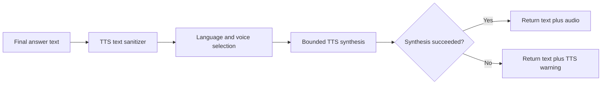

# Hybrid AI Gateway — Voice Pipeline

Version: 1.0

Last reviewed: 13 July 2026

Status: **Target / Gap** — STT and TTS are not implemented in the repository today

## 1. Purpose

This document owns **future speech-to-text (STT) input and text-to-speech (TTS) output contracts**. Voice adapters must wrap the same text-first AI pipeline defined in `docs/architecture/AI_PIPELINE.md`. They must not bypass chat, memory, retrieval, or tool policy.

Authorities: `AI_PIPELINE.md` §3.6, §7.2, §13, §15, §18, §19, §21; PRD FR-CHAT-013; OD-018.

## 2. Explicit Non-Claims

Do **not** claim Implemented:

- STT service or audio-input HTTP route
- TTS engine or audio response pipeline
- `input_modality` / `response_mode` public contract end-to-end
- Wake word, always-on microphone, or offline speech stack

Phase 1 MVP explicitly defers voice (PRD §5.4, OD-018).

## 3. Principles

| Principle | Rule |
|---|---|
| Text-first | Accepted STT transcript enters the same canonical pipeline as typed text (AI-PIPE-001) |
| Exact short-term | Store accepted transcript wording, not a paraphrased rewrite |
| TTS failure | Preserve complete text response; attach nonfatal TTS warning (AI-PIPE-012) |
| Terminology | Spoken **input** = STT; spoken **output** = TTS. Input never “comes from TTS” |
| Authority | Untrusted audio/transcript cannot set memory scope, network policy, or tool permission |

## 4. Speech Input Flow (Target)

From `AI_PIPELINE.md` §7.2:

1. Accept supported audio with byte, duration, format, and rate limits.
2. Normalize audio in a bounded temporary workspace.
3. Run STT (local or configured provider).
4. Record transcription confidence and language.
5. If confidence below policy, require user review/correction before long-term promotion.
6. Set accepted transcript as `original_text`.
7. Delete raw audio per retention policy (default ephemeral).
8. Continue through the text pipeline (scope, short-term write, retrieval, generation).

Validation (`§7.3`): empty text rejected; oversized rejected; unconfirmed low-confidence transcripts may sit in short-term but must not auto-promote to long-term; secrets must not auto-promote.

## 5. Response Modality Policy (Target)

| `response_mode` | Behavior |
|---|---|
| `text` | Return text/stream only |
| `speech` | Return text and synthesize speech |
| `follow_input` | Speech in → speech + text; text in → text |

Even for speech output, final text remains available for accessibility, recovery, logging policy, and TTS failure fallback.

## 6. TTS Pipeline (Target)

Requirements:

- Do not speak citation URLs, markup, code fences, or control tokens literally unless requested.
- Select a compatible voice for language.
- Enforce input length and synthesis timeout; support cancellation.
- Keep generated audio ephemeral by default.
- Never delay text indefinitely waiting for audio.

## 7. Failure Matrix (Voice Rows)

| Failure | Required behavior |
|---|---|
| STT unavailable | Reject speech input with remediation; text input remains available |
| Low-confidence STT | Request transcript confirmation; do not auto-promote to long-term |
| TTS failure | Return complete text with TTS warning |
| Client cancellation | Stop STT/TTS where supported; mark partial turn accurately |

## 8. Configuration Knobs (Target Names)

Documented in `AI_PIPELINE.md` §18; treat as Target until present in `config.py`:

| Variable | Intent |
|---|---|
| `STT_ENABLED` | Gate speech input |
| `TTS_ENABLED` | Gate speech output |
| `DEFAULT_RESPONSE_MODE` | `text` / `speech` / `follow_input` |

Exact names may be finalized in `CONFIGURATION.md` when implemented.

## 9. Acceptance

| ID | Requirement | Acceptance summary |
|---|---|---|
| AI-PIPE-001 | Text and accepted STT transcripts enter same pipeline | Equivalent routing and retrieval |
| AI-PIPE-012 | TTS failure preserves complete text | Simulated synthesis failure returns text + nonfatal warning |
| FR-CHAT-013 | Future STT/TTS wrap text-first pipeline | Equivalent accepted text and transcripts; TTS failure preserves text |

## 10. Implementation Sequence Pointer

Voice adapters appear late in `AI_PIPELINE.md` §20 (steps 10–11), after envelope, memory lanes, evidence sufficiency, and search policy foundations.

## 11. Related Documents

- `docs/architecture/AI_PIPELINE.md` — authoritative pipeline
- `docs/architecture/API_DESIGN.md` — future public schemas
- `docs/planning/CURRENT_PHASE.md` — voice excluded from active Phase 1 scope
- `docs/planning/DECISIONS.md` — OD-018
